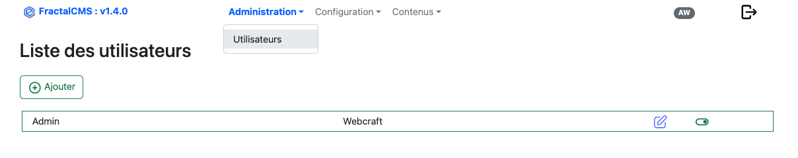
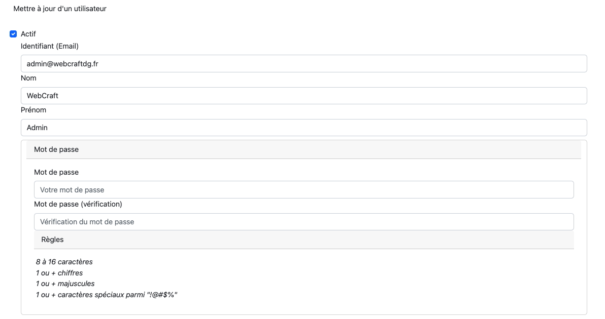
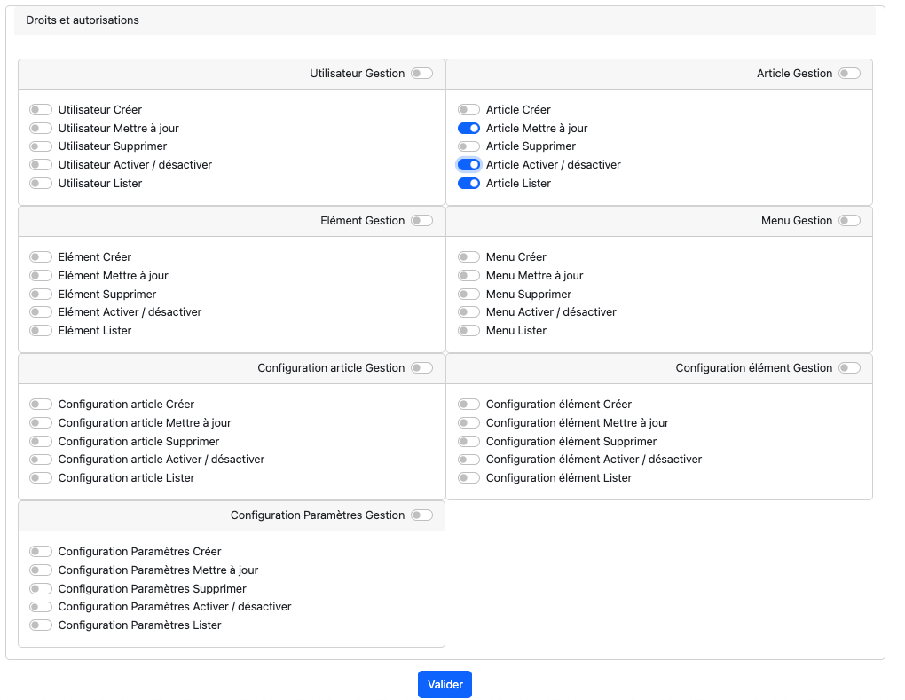

# Contenu
## Gestion des utilisateurs et droits

### Règle de modification

* Un utilisateur ne peut modifier ses droits et permissions

### Utilisateur administrateur

#### Commande de création

Afin d'accéder pour la première fois à l'interface administrateur, il faut créer un utilisateur.
Pour cela, la commande suivante permet de créer cet utilisateur.

``
php yii.php fractalCms:admin/create
``

#### Interface

La première page liste les utilisateurs déjà créés dans l'application.

#### Editer / Ajouter

L'édition d'un utilisateur se réalise en cliquant sur le stylet de la ligne.
La création se réalise en cliquant sur le bouton 'Ajouter'.

#### Partie haute du formulaire

Dans cette interface, il faut indiquer, l'identifiant (email), le nom, prénom et le mot de passe.
Le mot de passe est soumit à des règles de validations indiquées dans le formulaire.

La case à cocher 'Activer' permet d'activer ou désactiver un utilisateur. tant que l'utilisateur n'est pas activer, il ne pourra
pas se connecter.

#### Les droits et permissions

La configuration des droits et permissions permet de restreindre l'accès à certaines fonctionnalités de FractalCMS.

[<- Précédent](04-interface.md) |   [Suivant ->](06-avance.md)